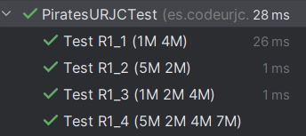
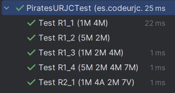
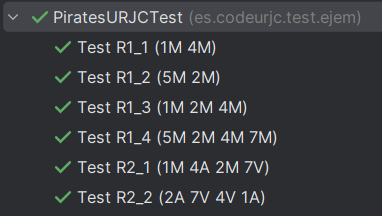
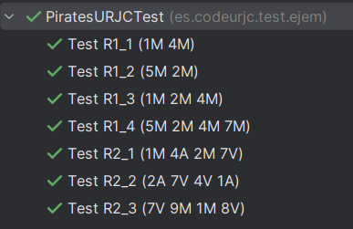
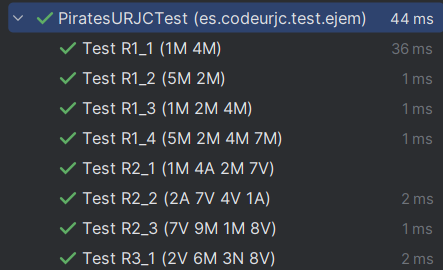
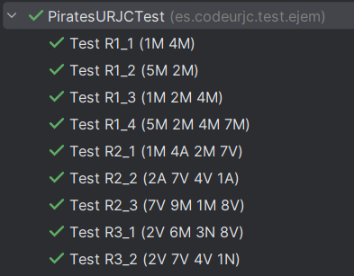
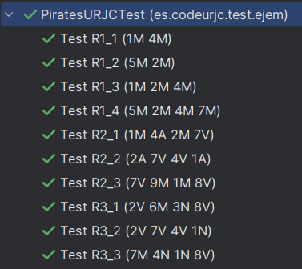

# AIS-Practica-3-2024

Nombre de los alumnos: Jorge Leal y Javier Laureano Ochoa

### Función comparativa
```java
public void funcionComparativa (String salida, String ronda) {
    PiratesURJC partida = new PiratesURJC();
    String resultado = partida.play(ronda);
    assertEquals(salida, resultado);
}
```
Descripción: 

### R1_1

**INPUT y OUTPUT**: "1M 4M" -> "Gana jugador 2"

**R1_1. Código de test**
```java
@Test
@DisplayName("Test R1_1 (1M 4M)")
public void TestR1_1 (){
    funcionComparativa("Gana jugador 2", "1M 4M");
}
```

**R1_1. Mensaje del test añadido que NO PASA**

```log
org.opentest4j.AssertionFailedError: 
Expected :Gana jugador 2
Actual  :null
```

**R1_1. Código mínimo para que el test pase**

```java
public String play(String ronda){
    return "Gana jugador 2";
}
```
Descripción: Como no hay requisitos, simplemente necesitamos un return con la salida deseada

**R1_1. Captura de que TODOS los test PASAN**


### R1_2

**INPUT y OUTPUT**: "5M 2M" -> "Gana jugador 1"

**R1_2. Código de test**
```java
@Test
@DisplayName("Test R1_2 (5M 2M)")
public void TestR1_2 (){
    funcionComparativa("Gana jugador 1", "5M 2M");
}
```

**R1_2. Mensaje del test añadido que NO PASA**

```log
org.opentest4j.AssertionFailedError: 
Expected :Gana jugador 1
Actual   :Gana jugador 2
```

**R1_2. Código mínimo para que el test pase**

```java
public String play(String ronda){
    if (ronda.equals("5M 2M"))
        return "Gana jugador 1";
    return "Gana jugador 2";
}
```
Descripción: Ahora disponemos de dos salidas en base a entradas diferentes, por lo que con un if y una condición gestionamos la salida

**R1_2. Captura de que TODOS los test PASAN**


### R1_3

**INPUT y OUTPUT**: "1M 2M 4M" -> "Gana jugador 3"

**R1_3. Código de test**
```java
@Test
@DisplayName("Test R1_3 (1M 2M 4M)")
public void TestR1_3 (){
    funcionComparativa("Gana jugador 3", "1M 2M 4M");
}
```

**R1_3. Mensaje del test añadido que NO PASA**

```log
org.opentest4j.AssertionFailedError: 
Expected :Gana jugador 3
Actual   :Gana jugador 2
```

**R1_3. Código mínimo para que el test pase**

```java
public String play(String ronda){
    if (ronda.equals("5M 2M"))
        return "Gana jugador 1";
    else if (ronda.equals("1M 2M 4M"))
        return "Gana jugador 3";
    return "Gana jugador 2";
}
```
Descripción: Ahora disponemos de tres salidas en base a entradas diferentes, por lo que con dos if y dos condiciones gestionamos la salida

**R1_3. Captura de que TODOS los test PASAN**


### R1_4

**INPUT y OUTPUT**: "5M 2M 4M 7M" -> "Gana jugador 4"

**R1_4. Código de test**
```java
@Test
@DisplayName("Test R1_4 (5M 2M 4M 7M)")
public void TestR1_4 (){
    funcionComparativa("Gana jugador 4", "5M 2M 4M 7M");
}
```

**R1_4. Mensaje del test añadido que NO PASA**

```log
org.opentest4j.AssertionFailedError: 
Expected :Gana jugador 4
Actual   :Gana jugador 2
```

**R1_4. Código mínimo para que el test pase**

```java
public String play(String ronda){
    if (ronda.equals("5M 2M"))
        return "Gana jugador 1";
    else if (ronda.equals("1M 2M 4M"))
        return "Gana jugador 3";
    else if (ronda.equals("5M 2M 4M 7M"))
        return "Gana jugador 4";
    return "Gana jugador 2";
}
```
Descripción: Ahora disponemos de cuatro salidas en base a entradas diferentes, por lo que con tres if y tres condiciones gestionamos la salida

**R1_4. Captura de que TODOS los test PASAN**


**R1_4. Refactorización**

Justificación: Al analizar los ejemplos podemos observar que cuando la letra es la misma en todas las entradas,
el ganador es el que tenga el número más alto. Por lo que almacenamos la letra y el número del primer jugador y comparamos 
este último con el del resto de jugadores para almacenar el número mas alto. Quien poseea el numero más alto será el ganador.
```java
public String play(String ronda) {
    char letra = ronda.charAt(1);
    int valorMax = Character.getNumericValue(ronda.charAt(0));
    int jugador = 0;
    String[] jugadoresArray = ronda.split(" ");
    for (int i = 1; i < jugadoresArray.length; i++) {
        char jugadorLetra = jugadoresArray[i].charAt(1);
        int jugadorValor = Character.getNumericValue(jugadoresArray[i].charAt(0));

        if (letra == jugadorLetra) {
            if (valorMax < jugadorValor) {
                valorMax = jugadorValor;
                jugador = i;
            }
        } else {
            return null;
        }    
    }
    return "Gana jugador " + (jugador+1);
}
```
**R1_4. Captura de que TODOS los tests PASAN tras la refactorización**



### R2_1

**INPUT y OUTPUT**: "1M 4A 2M 7V" -> "Gana jugador 3"

**R2_1. Código de test**
```java
@Test
@DisplayName("Test R2_1 (1M 4A 2M 7V)")
public void TestR2_1 (){
    funcionComparativa("Gana jugador 3", "1M 4A 2M 7V");
}
```

**R2_1. Mensaje del test añadido que NO PASA**

```log
org.opentest4j.AssertionFailedError: 
Expected :Gana jugador 3
Actual   :null
```

**R2_1. Código mínimo para que el test pase**

```java
public String play(String ronda) {
    char letra = ronda.charAt(1);
    int valorMax = Character.getNumericValue(ronda.charAt(0));
    int jugador = 0;
    String[] jugadoresArray = ronda.split(" ");
    
    for (int i = 1; i < jugadoresArray.length; i++) {
        char jugadorLetra = jugadoresArray[i].charAt(1);
        int jugadorValor = Character.getNumericValue(jugadoresArray[i].charAt(0));

        if (letra == jugadorLetra) {
            if (valorMax < jugadorValor) {
                valorMax = jugadorValor;
                jugador = i;
            }
        } else {
            return "Gana jugador 3";
        }
    }
    return "Gana jugador " + (jugador+1);
}
```
Descripción: Cuando una letra sea diferente, devolver como ganador al jugador 3.

**R2_1. Captura de que TODOS los test PASAN**



### R2_2

**INPUT y OUTPUT**: "2A 7V 4V 1A" -> "Gana jugador 1"

**R2_2. Código de test**
```java
@Test
@DisplayName("Test R2_2 (2A 7V 4V 1A)")
public void TestR2_2(){
    funcionComparativa("Gana jugador 1", "2A 7V 4V 1A");
}
```

**R2_2. Mensaje del test añadido que NO PASA**

```log
org.opentest4j.AssertionFailedError: 
Expected :Gana jugador 1
Actual   :Gana jugador 3
```

**R2_2. Código mínimo para que el test pase**

```java
public String play(String ronda) {
    char letra = ronda.charAt(1);
    int valorMax = Character.getNumericValue(ronda.charAt(0));
    int jugador = 0;
    String[] jugadoresArray = ronda.split(" ");

    for (int i = 1; i < jugadoresArray.length; i++) {
        char jugadorLetra = jugadoresArray[i].charAt(1);
        int jugadorValor = Character.getNumericValue(jugadoresArray[i].charAt(0));

        if (letra == jugadorLetra) {
            if (valorMax < jugadorValor) {
                valorMax = jugadorValor;
                jugador = i;
            }
        } 
    }
    return "Gana jugador " + (jugador+1);
}
```
Descripción: Al tener ya almacenada la letra y el valor del primer jugador, simplemente tenemos que comparar los numeros 
que tengan la misma letra que el primer jugador ignorando el resto de casos haciendo uso del if.

**R2_2. Captura de que TODOS los test PASAN**



### R2_3

**INPUT y OUTPUT**: "7V 9M 1M 8V" -> "Gana jugador 4"

**R2_3. Código de test**
```java
@Test
@DisplayName("Test R2_3 (7V 9M 1M 8V)")
public void TestR2_3(){
    funcionComparativa("Gana jugador 4", "7V 9M 1M 8V");
}
```
**R2_3. Mensaje del test añadido que NO PASA**

En este caso si que pasa el test añadido ya que esta situación es muy parecida a la del caso anteror.
Tenemos almacenado el numero y letra del primer jugador y lo comparamos con los jugadores que tengan
la misma letra que este.


**R2_3. Código mínimo para que el test pase**

No se han realizado modificaciones, el codigo es idéntico al del caso anteror.


**R2_3. Captura de que TODOS los test PASAN**



### R3_1

**INPUT y OUTPUT**: "2V 6M 3N 8V" -> "Gana jugador 3"

**R3_1. Código de test**
```java
@Test
@DisplayName("Test R3_1 (2V 6M 3N 8V)")
public void TestR3_1(){
    funcionComparativa("Gana jugador 3", "2V 6M 3N 8V");
}
```

**R3_1. Mensaje del test añadido que NO PASA**

```log
org.opentest4j.AssertionFailedError: 
Expected :Gana jugador 3
Actual   :Gana jugador 4
```

**R3_1. Código mínimo para que el test pase**

```java
public String play(String ronda) {
    char letra = ronda.charAt(1);
    int valorMax = Character.getNumericValue(ronda.charAt(0));
    int jugador = 0;
    String[] jugadoresArray = ronda.split(" ");

    for (int i = 0; i < jugadoresArray.length; i++) {
        char jugadorLetra = jugadoresArray[i].charAt(1);
        int jugadorValor = Character.getNumericValue(jugadoresArray[i].charAt(0));

        if ('N'==jugadorLetra){
            return "Gana jugador " + (i+1);
        }
        if (letra == jugadorLetra) {
            if (valorMax < jugadorValor) {
                valorMax = jugadorValor;
                jugador = i;
            }
        }
    }
    return "Gana jugador " + (jugador+1);
}
```
Descripción: Esta vez inicializamos el bucle a 0 para si en cualquier caso se detecta una "N" devuelva como ganador el 
jugador que posea esa carta.

**R3_1. Captura de que TODOS los test PASAN**



### R3_2

**INPUT y OUTPUT**: "2V 7V 4V 1N" -> "Gana jugador 4"

**R3_2. Código de test**
```java
@Test
@DisplayName("Test R3_2 (2V 7V 4V 1N)")
public void TestR3_2(){
    funcionComparativa("Gana jugador 4", "2V 7V 4V 1N");
}
```

**R3_2. Mensaje del test añadido que NO PASA**

En este caso el test añadido si que pasa ya que, como en el caso anteror, al detectar la primera carta negra devolvemos 
como ganador a ese jugador.

**R3_2. Código mínimo para que el test pase**

No se han realizado modificaciones, el codigo es idéntico al del caso anteror.

**R3_2. Captura de que TODOS los test PASAN**



### R3_3

**INPUT y OUTPUT**: "7M 4N 1N 8V" -> "Gana jugador 2"

**R3_3. Código de test**
```java
@Test
@DisplayName("Test R3_3 (7M 4N 1N 8V)")
public void TestR3_3(){
    funcionComparativa("Gana jugador 2", "7M 4N 1N 8V");
}
```

**R3_3. Mensaje del test añadido que NO PASA**

En este caso nos pasa el test debido a que detectamos la primera "N", que en este caso coincide con que
tiene el valor mas alto, pero nos damos cuenta de la verdadera funcionalidad de las cartas negras donde gana 
el jugador que tenga la carta negra con el valor mas alto.

**R3_3. Código mínimo para que el test pase**
```java
    public String play(String ronda) {
        char letra = ronda.charAt(1);
        int valorMax = Character.getNumericValue(ronda.charAt(0));
        int jugador = 0;
        boolean esPrimeraN=false;
        String[] jugadoresArray = ronda.split(" ");

        for (int i = 0; i < jugadoresArray.length; i++) {
            char jugadorLetra = jugadoresArray[i].charAt(1);
            int jugadorValor = Character.getNumericValue(jugadoresArray[i].charAt(0));

            if ('N'==jugadorLetra){
                if (!esPrimeraN){
                    valorMax = jugadorValor;
                    jugador = i;
                    esPrimeraN=true;
                    letra='N';
                }
            }
            if (letra == jugadorLetra) {
                if (valorMax < jugadorValor) {
                    valorMax = jugadorValor;
                    jugador = i;
                }
            }
        }
        return "Gana jugador " + (jugador+1);
    }
```
Descripción: Al detectar una 'N', si esta es la primera, inicializamos el valor de la carta negra como valor máximo y cambiamos la letra que se compara
a 'N'. Si se detecta una segunda simplemente entraría en if que teníamos previamente para comparar los valores numéricos.

**R3_3. Captura de que TODOS los test PASAN**




