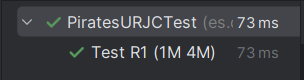
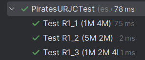
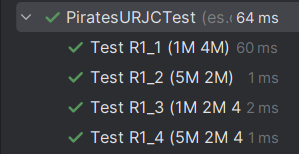
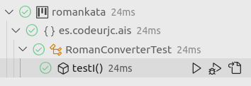

# AIS-Practica-3-2024

Nombre de los alumnos: Jorge Leal y Javier Laureano Ochoa

### Función comparativa
```java
public void funcionComparativa (String salida, String ronda) {
    PiratesURJC partida = new PiratesURJC();
    String resultado = partida.play(ronda);
    assertEquals(resultado, salida);
}
```
Descripción: 

### R1_1

**INPUT y OUTPUT**: "1M 4M" -> "Gana jugador 2"

**R1_1. Código de test**
```java
@Test
@DisplayName("Test R1_1 (1M 4M)")
public void TestR1_1 (){
    funcionComparativa("Gana jugador 2", "1M 4M");
}
```

**R1_1. Mensaje del test añadido que NO PASA**

```log
org.opentest4j.AssertionFailedError: 
Expected :null
Actual:Gana jugador 2
```

**R1_1. Código mínimo para que el test pase**

```java
public String play(String ronda){
    return "Gana jugador 2";
}
```
Descripción: Como no hay requisitos, simplemente necesitamos un return con la salida deseada

**R1_1. Captura de que TODOS los test PASAN**



### R1_2

**INPUT y OUTPUT**: "5M 2M" -> "Gana jugador 1"

**R1_2. Código de test**
```java
@Test
@DisplayName("Test R1_2 (5M 2M)")
public void TestR1_2 (){
    funcionComparativa("Gana jugador 1", "5M 2M");
}
```

**R1_2. Mensaje del test añadido que NO PASA**

```log
org.opentest4j.AssertionFailedError: 
Expected :Gana jugador 2
Actual   :Gana jugador 1
```

**R1_2. Código mínimo para que el test pase**

```java
public String play(String ronda){
    if (ronda.equals("5M 2M"))
        return "Gana jugador 1";
    return "Gana jugador 2";
}
```
Descripción: Ahora disponemos de dos salidas en base a entradas diferentes, por lo que con un if y una condición gestionamos la salida

**R1_2. Captura de que TODOS los test PASAN**


### R1_3

**INPUT y OUTPUT**: "1M 2M 4M" -> "Gana jugador 3"

**R1_3. Código de test**
```java
@Test
@DisplayName("Test R1_3 (1M 2M 4M)")
public void TestR1_3 (){
    funcionComparativa("Gana jugador 3", "1M 2M 4M");
}
```

**R1_3. Mensaje del test añadido que NO PASA**

```log
org.opentest4j.AssertionFailedError: 
Expected :Gana jugador 2
Actual   :Gana jugador 3
```

**R1_3. Código mínimo para que el test pase**

```java
public String play(String ronda){
    if (ronda.equals("5M 2M"))
        return "Gana jugador 1";
    else if (ronda.equals("1M 2M 4M"))
        return "Gana jugador 3";
    return "Gana jugador 2";
}
```
Descripción: Ahora disponemos de tres salidas en base a entradas diferentes, por lo que con dos if y dos condiciones gestionamos la salida

**R1_3. Captura de que TODOS los test PASAN**



### R1_4

**INPUT y OUTPUT**: "5M 2M 4M 7M" -> "Gana jugador 4"

**R1_4. Código de test**
```java
@Test
@DisplayName("Test R1_4 (5M 2M 4M 7M)")
public void TestR1_4 (){
    funcionComparativa("Gana jugador 4", "5M 2M 4M 7M");
}
```

**R1_4. Mensaje del test añadido que NO PASA**

```log
org.opentest4j.AssertionFailedError: 
Expected :Gana jugador 2
Actual   :Gana jugador 4
```

**R1_4. Código mínimo para que el test pase**

```java
public String play(String ronda){
    if (ronda.equals("5M 2M"))
        return "Gana jugador 1";
    else if (ronda.equals("1M 2M 4M"))
        return "Gana jugador 3";
    else if (ronda.equals("5M 2M 4M 7M"))
        return "Gana jugador 4";
    return "Gana jugador 2";
}
```
Descripción: Ahora disponemos de cuatro salidas en base a entradas diferentes, por lo que con tres if y tres condiciones gestionamos la salida

**R1_4. Captura de que TODOS los test PASAN**



**R1. Refactorización**

Justificación: Al analizar los ejemplos podemos observar que cuando la letra es la misma en todas las entradas, el ganador es el que tenga el número más alto.

```java
public String convert(int number){
    return "I"; // Imaginemos que hemos refactorizado aquí
}
```
**R1. Captura de que TODOS los tests PASAN tras la refactorización**


